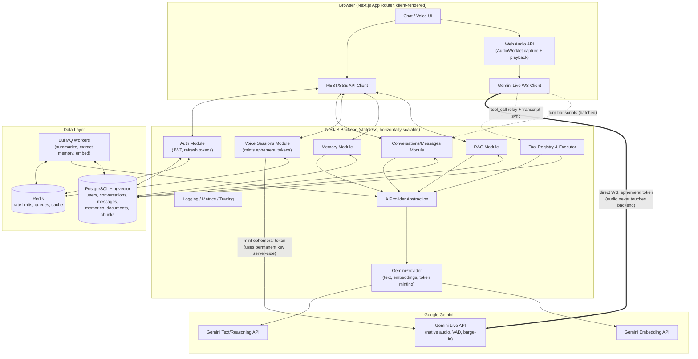

# JARVIS — Architecture & Planning (Step 1)

Status: **Draft for approval**. No application code has been written yet.

---

## 0. Guiding constraints

- AI provider = **Google Gemini only**, isolated behind an `AIProvider` abstraction so another provider could be added later without touching business logic.
- Real-time voice uses the **Gemini Live API**.
- Permanent Gemini API keys never reach the browser — the browser only ever holds **short-lived ephemeral tokens**.
- Development must work on Gemini's free/low-cost tier; nothing assumes unlimited quota.

---

## 1. Frontend

**Choice: Next.js (App Router) + React + TypeScript.**

This app is an authenticated, highly interactive client (real-time audio, WebSocket state, mic/speaker device APIs). Those are all client-only concerns — Web Audio/AudioWorklet, `getUserMedia`, and a direct browser→Gemini WebSocket all need to run in the browser, not on a server render pass — so the app shell (sidebar, chat, voice mode, memory/knowledge/tools/settings views) is built almost entirely of Client Components (`'use client'`), with in-memory view-switching rather than a route per view, the same way a ChatGPT-style single-page app behaves. Next.js is used here for its App Router file conventions, `next/font` self-hosted fonts, and the option to add server-rendered routes later (a public marketing/landing page, an OAuth callback page, a webhook route handler) without standing up a second app. No server data-fetching or Server Components have been adopted yet — that arrives once Step 4+ wires the client to the real backend/Gemini session.

- **Routing:** Next.js App Router file-system routing. The chat shell itself is a single client-rendered route; App Router is available for future server-rendered routes as the product grows.
- **Server state:** TanStack Query (API calls, caching, retries) — introduced when Step 4 wires up real backend calls.
- **Client/UI state:** Zustand (small, no boilerplate) for conversation UI state, mic/speaker/connection state machines — the Step 3 foundation uses local `useState`/`useEffect` in a single client component tree; Zustand gets introduced if/when that state needs to be shared across routes.
- **Styling:** Tailwind CSS v4, with design tokens (colors, fonts) wired through CSS custom properties so the dark/light theme can be toggled at runtime via a `data-theme` attribute rather than `prefers-color-scheme` alone.
- **Forms/validation:** React Hook Form + Zod (shared Zod schemas with backend via `packages/shared-types` where practical) — introduced alongside the first real form (auth) in a later step.

**Alternative considered:** a plain Vite SPA. Simpler mental model for a client-only app and was the original choice for this project — reversed in favor of Next.js so the app can grow a server-rendered surface (marketing, auth callbacks, webhooks) later without a second app, at the cost of adopting the Server/Client Component boundary now.

---

## 2. Backend

**Choice: NestJS + TypeScript.**

Why: strong module boundaries via DI, first-class support for guards/interceptors/pipes (maps cleanly onto auth, validation, rate limiting, logging), native WebSocket gateway support, and a structure that scales in complexity gracefully as Steps 9–11 (memory, tools, RAG) get added as new modules rather than new spaghetti.

**Alternative considered:** raw Express/Fastify. Faster to start, but you end up hand-rolling what Nest gives for free (DI, module isolation, decorator-based validation), and this project has enough moving parts (auth, conversations, tools, RAG, voice sessions, monitoring) that the structure pays for itself quickly.

**HTTP adapter:** Fastify under Nest (`@nestjs/platform-fastify`) instead of the default Express adapter — better raw throughput and lower overhead for a latency-sensitive app, at negligible migration cost since we're starting fresh.

---

## 3. Real-time communication architecture (the central decision)

Two options were evaluated for voice:

**A. Client → Gemini Live API directly** (backend only mints ephemeral tokens)
**B. Client → NestJS → Gemini Live API** (backend proxies the full audio WebSocket)

| | A: Direct client→Gemini | B: Proxied through NestJS |
|---|---|---|
| Latency | Lowest — one network hop each way | Higher — audio traverses an extra hop both directions |
| Backend load/cost | Minimal — no audio bandwidth through our servers | High — every voice session's audio bandwidth doubles through our infra |
| Scalability | Backend stays stateless/cheap; Gemini absorbs session scaling | Backend becomes stateful per session, needs sticky routing or a Redis-backed WS layer just to scale horizontally |
| Security | Requires ephemeral token mechanism (supported by Gemini Live API) | Backend fully mediates, slightly simpler trust model |
| Tool calling | Needs a relay hop: Gemini → client → backend (execute) → client → Gemini | Backend can execute tools inline without relay |
| Maintainability | Two thin integration points (token minting, tool relay) | One big stateful proxy to maintain (reconnects, backpressure, audio framing) |

**Decision: Option A — direct client → Gemini Live API, authenticated via short-lived ephemeral tokens minted by NestJS.**

Rationale: the plan explicitly prioritizes *extremely low latency* and *natural conversation*, and Gemini Live API's ephemeral-token feature exists specifically to make this pattern safe (short-lived, scoped, single-purpose tokens instead of the permanent server key). Proxying audio through NestJS would add a full extra hop of latency and jitter to every audio frame in both directions, and turn the backend into a stateful, hard-to-scale component — for no security benefit, since ephemeral tokens already solve the "don't expose the permanent key" problem.

**Consequence — tool calling relay:** when Gemini requests a function call during a live voice session, the event arrives on the client's WebSocket. The client immediately forwards it to an authenticated NestJS REST endpoint, which validates/authorizes/executes it against the Tool Registry (Section 11) and returns the result; the client relays the result back into the Live session. The client is just a dumb relay here — it never decides *whether* a tool is allowed to run, it just carries bytes; all authorization and execution happen server-side. This adds one extra round trip only for tool calls, not for audio/speech, so it doesn't compromise conversational latency.

**Text-mode conversations** (no voice) go the conventional route: **Client → NestJS → Gemini** (standard `generateContent`/streaming), because text turns aren't latency-critical in the same way, and this path is where RAG context, memory injection, tool calling, and cost/token accounting need to happen anyway — keeping it fully server-mediated is simpler and more controllable.

### Session flow (voice)

1. Client authenticates normally (JWT) and calls `POST /voice/session-token`.
2. NestJS checks the user's quota/rate limit (Redis counters), then calls the Gemini API server-side (using the permanent key, which never leaves the server) to mint a short-lived ephemeral token scoped to a specific model/config.
3. NestJS returns the ephemeral token to the client.
4. Client opens a WebSocket directly to the Gemini Live API using that token.
5. Client streams mic audio up, plays streamed audio down, handles interruption locally (Section 7) based on server-sent events.
6. Client reports transcript/turn events back to NestJS (batched, not per-audio-chunk) so conversations persist in Postgres like text conversations do.
7. On disconnect/expiry, the client requests a fresh token to start a new session; nothing is reused.

### Connection lifecycle (both text WS-fallback and voice)

- Exponential backoff reconnect with jitter, capped retries before surfacing a "reconnect manually" UI state.
- Heartbeat/ping to detect silent connection death.
- Explicit connection state machine on the client: `idle → connecting → connected → (interrupted|error) → reconnecting → closed`.
- Graceful disconnect always flushes any pending transcript to the backend before tearing down.

---

## 4. Audio streaming architecture

- **Capture:** `getUserMedia` → Web Audio API → `AudioWorkletNode` (not the deprecated `ScriptProcessorNode`) resampling to 16 kHz mono PCM16, chunked and sent over the Live API's WebSocket protocol as the API expects.
- **Playback:** streamed output audio chunks queued and played through an `AudioWorklet`-backed player with its own small jitter buffer, so playback stays smooth even if chunks arrive with uneven timing.
- **Why not WebRTC:** Gemini Live API's browser-facing protocol is WebSocket-based, not a WebRTC ingestion endpoint. Introducing WebRTC would mean standing up a separate media server (e.g., LiveKit/Pipecat) between the client and Gemini purely to transcode/bridge — extra infra and latency for no gain today. Worth revisiting only if we later need multi-party audio or non-Gemini SFU features.
- **VAD:** handled natively by the Gemini Live API server-side (Section 7) — we don't implement a custom VAD model for MVP. Client-side, we still track "is the mic actively producing above-threshold audio" locally purely for UI indicators (the "listening" pulse), not for interruption logic.

---

## 5. Gemini integration architecture

- **SDK:** the unified `@google/genai` SDK, used both server-side (Node, NestJS) for text/embeddings/token-minting, and client-side (browser bundle) for the direct Live API connection.
- **Isolation:** all Gemini-specific code lives behind an `AIProvider` interface in `apps/api/src/modules/ai-provider/`:

```
AIProvider (interface)
├── generateText(...)          // streaming + non-streaming text
├── generateEmbedding(...)
├── mintLiveSessionToken(...)  // ephemeral token issuance
└── (future) transcribe / synthesize if ever needed standalone

GeminiProvider implements AIProvider
FutureProvider implements AIProvider   // not built now, just a documented seam
```

Nothing outside this module ever imports `@google/genai` directly. Conversations, memory, tools, and RAG modules depend only on `AIProvider`.

- **Config isolation:** every model ID is an environment variable (`GEMINI_TEXT_MODEL`, `GEMINI_LIVE_MODEL`, `GEMINI_EMBEDDING_MODEL`), never a string literal in code, so model upgrades are a config change, not a deploy.

---

## 6. Speech-to-text / text-to-speech strategy

Gemini's **native audio dialog** Live models handle STT and TTS *inside* the model itself — audio in, audio out, no separate transcription/synthesis service needed for the voice pipeline. We enable the Live API's built-in **input/output transcription option** so we still get text transcripts of both sides of the conversation for storage, search, and memory extraction, without running a separate STT pass ourselves.

Text-mode (typed) conversations obviously need no STT/TTS at all.

We deliberately do **not** stand up a separate STT/TTS pipeline (e.g., calling a transcription model and a separate voice model) — that's strictly worse on latency and complexity than the Live API's integrated approach, and would fight against the "not record→transcribe→wait→respond" requirement in Step 5.

---

## 7. Interruption / barge-in architecture

The Gemini Live API has **native, server-side VAD and automatic interruption handling**: when it detects the user speaking while the model is talking, it stops generating and emits an interruption signal over the session. We build on top of that rather than reimplementing VAD:

- Client subscribes to the Live session's interruption/turn events.
- On receiving an interruption signal, the client **immediately** stops/flushes its local audio playback queue (don't wait for a network round trip to confirm — clear the buffer client-side the instant the signal arrives, since any already-buffered audio is now stale).
- Conversation state on the backend marks the previous assistant turn as `interrupted` (partial) rather than `completed`, so history/summarization treats it correctly.
- New user audio becomes the start of the next turn immediately; no explicit "stop button" state machine is needed because the server already treats this as a natural turn boundary.
- Edge cases (rapid re-interruption, silence after interrupting, interruption while the very first audio chunk is still buffering) are handled by keeping the playback queue and the "current turn id" as the single source of truth — any event tagged with a stale turn id is dropped.

---

## 8. Conversation state management

- **Source of truth:** Postgres (`conversations`, `messages` tables). The frontend never treats its local state as authoritative — it's a live view over what the backend persists.
- **Text mode:** normal request → SSE/stream response → persist on completion (and persist partial content if interrupted).
- **Voice mode:** client buffers transcript deltas locally and flushes to `POST /conversations/:id/turns` at natural turn boundaries (end of user turn, end of assistant turn, or on interruption) — not per audio chunk, to avoid hammering the backend.
- **Multi-tab/session:** conversation state is per `conversationId`; concurrent voice sessions for the same conversation are not supported in v1 (a new voice session for a conversation invalidates/ends any prior one for that conversation).

---

## 9. Memory architecture

Two tiers, both ultimately backend-controlled (the AI is used to *propose* memories, never to *store* them directly):

**Short-term:** the live conversation window plus a rolling summary. Once a conversation exceeds a token threshold, a background job (not the live request path) asks a cheap Gemini model to summarize older turns into a compact `conversation.summary` field, which replaces raw old turns in future context construction.

**Long-term:** durable, cross-conversation facts about the user, stored in a `memories` table (`content`, `embedding vector`, `user_id`, `source_conversation_id`, `created_at`, `last_used_at`, `confidence`). Extraction happens as an async background job after a conversation turn (batched, not on every message) — a Gemini call proposes candidate memories; the backend deduplicates against existing memories (via embedding similarity threshold) before writing, and explicitly filters obviously sensitive categories (e.g., raw credentials, health/financial specifics) unless the user has explicitly opted into storing that class of information.

Retrieval: before sending a request to Gemini, the backend does a similarity search over `memories` scoped to the user, combined with recency weighting, and injects only the top-N relevant memories into the system context — never the whole memory store.

User control: `GET/DELETE /memories` endpoints and a UI surface (Step 13) so users can see and delete anything stored about them.

---

## 10. Tool/function calling architecture

```
Gemini → tool_call request → Tool Registry lookup → Zod schema validation
       → Auth/permission check → (confirmation step if sensitive) → Execute
       → Audit log write → Result → back to Gemini
```

- **Tool Registry:** a plain in-code registry (`{ name, description, parameterSchema: ZodSchema, handler, requiresConfirmation, requiredPermission }`), passed to Gemini as function declarations. Gemini can only ever request tools present in this registry — there is no path from a model output to arbitrary code execution.
- **Validation:** every tool call's arguments are parsed against its Zod schema before the handler runs; invalid arguments are rejected and the error is returned to Gemini (which can retry with corrected arguments) rather than crashing the request.
- **Authorization:** tool handlers receive the authenticated user context and check permissions explicitly; nothing runs with elevated/service-level privilege on the model's say-so.
- **Sensitive actions** (anything destructive or side-effecting, e.g., "send a message," "delete a reminder") require an explicit `requiresConfirmation` flag that surfaces a UI confirmation before execution, rather than firing immediately.
- **Reliability:** per-tool timeout, bounded retries for idempotent tools only, structured error results fed back to the model so it can explain the failure conversationally instead of hanging.
- **Audit trail:** every tool invocation (who, what, arguments, result, timestamp) is logged to a `tool_invocations` table.

Starting tool set (Step 10): `get_current_time`, `search_application_data` (read-only, scoped to the user's own data), `create_reminder`.

---

## 11. RAG architecture

```
Documents → Parser → Chunker → Gemini Embeddings → Postgres+pgvector
                                                        ↓
                                        Semantic Search (top-k, cosine)
                                                        ↓
                                         Relevant chunks + citations
                                                        ↓
                                          Injected into Gemini prompt
                                                        ↓
                                          Answer with source citations
```

- **Formats:** PDF (`pdf-parse`), DOCX (`mammoth`), Markdown/TXT (native), with a common internal `ParsedDocument` shape so the chunker doesn't care about source format.
- **Chunking:** recursive, token-aware chunking (~500–800 tokens, ~10–15% overlap) preserving section/heading metadata for better citations.
- **Embeddings:** current Gemini embedding model (Section "Model Strategy" below), called through the same `AIProvider.generateEmbedding` seam — the vector store itself has zero Gemini-specific code, so swapping embedding providers later only touches one adapter.
- **Storage:** `document_chunks` table in the *same* Postgres instance (pgvector extension) — no separate vector DB service. This keeps ops simple at this scale and avoids a second system to secure/back up; revisit only if retrieval volume/latency ever demands a dedicated vector store.
- **Isolation:** every chunk row carries `owner_user_id`/`org_id`; all retrieval queries are scoped by that column — no cross-tenant leakage is possible at the query level, not just the application level.
- **Cost/latency discipline:** never inject full documents into context — only retrieved top-k chunks, capped by a token budget. Re-embedding is skipped for unchanged documents via a content hash check.

---

## 12. Authentication and security

- **Auth:** email/password (argon2 hashing) + JWT access tokens (short-lived, ~15 min) + refresh tokens (httpOnly, secure, sameSite cookies, longer-lived, rotated on use).
- **Authorization:** Nest guards on every route; resource ownership checked in service layer (never trust a client-supplied `userId`/`conversationId` pairing without a DB check).
- **Ephemeral Gemini tokens:** minted only for authenticated requests, scoped and short-lived, never logged in plaintext.
- **Transport:** HTTPS everywhere in production (Section 15); WebSocket connections (both to our backend and directly to Gemini) run over `wss://`.
- **Input validation:** class-validator DTOs on every Nest controller; Zod schemas for tool arguments and any client-constructed payloads.
- **Rate limiting:** `@nestjs/throttler` + Redis-backed counters for auth endpoints, voice-session-token minting, and general API abuse prevention.
- **Secrets:** `.env` files locally (gitignored), a proper secrets manager in production (Section 15) — the permanent Gemini API key exists only in the backend's runtime environment.
- Full deep-dive audit happens in Step 14; this section defines the baseline the rest of the build follows from day one.

---

## 13. Database architecture

**Single PostgreSQL instance** (with `pgvector` extension) as the system of record, plus **Redis** for ephemeral/fast-changing state.

Core tables (illustrative, not final schema):
- `users`, `refresh_tokens`
- `conversations`, `messages`
- `memories` (with `embedding vector`)
- `documents`, `document_chunks` (with `embedding vector`)
- `tool_invocations` (audit log)
- `voice_sessions` (session id, token issuance metadata, start/end, turn count — not the audio itself)

**Redis** handles: rate-limit counters, ephemeral-token issuance throttling, short-lived caches (e.g., recent memory-retrieval results), and BullMQ job queues (memory extraction, embedding generation, summarization) — keeping those off the synchronous request path.

**Migrations:** TypeORM or Prisma migrations (decision deferred to Step 2 based on a quick DX comparison, both fit this architecture equally well).

---

## 14. Logging and monitoring

- **Structured logging:** Pino (fast, JSON, integrates cleanly with Nest) with request correlation IDs threaded through HTTP and WS handlers.
- **Error tracking:** Sentry (or self-hosted GlitchTip if cost-sensitive) for both frontend and backend.
- **Metrics:** Prometheus counters/histograms for request latency, Gemini call latency/token usage, tool invocation counts/failures, voice session duration — visualized in Grafana.
- **Tracing:** OpenTelemetry spans across HTTP request → Gemini call → DB query, so a slow turn is diagnosable end-to-end.
- **Privacy discipline:** logs never contain raw message content or memory content at info level by default — payload bodies are redacted/truncated in logs; full content stays in Postgres where access is controlled, not in log aggregation.

---

## 15. Deployment architecture

- **Containerization:** Docker for both `apps/web` (built static assets served by a lightweight Nginx container) and `apps/api` (Node/NestJS).
- **Reverse proxy:** Caddy (or Nginx) terminates TLS, handles HTTP→HTTPS redirect, proxies `/api` and WS upgrade paths to the backend, serves the frontend's static build directly.
- **Target:** single VPS via Docker Compose for initial launch (matches the "reasonable development/running cost" constraint); the compose setup is written so it maps cleanly onto a managed container platform later if scale demands it, without a rewrite.
- **Environments:** distinct `.env.development` / `.env.production`, distinct (cheaper) model configs for dev.
- **CI/CD:** GitHub Actions — lint/typecheck/test on PR, build+push images and deploy on merge to `main` (detailed in Step 17).

---

## 16. Scalability strategy

- Backend instances are **stateless** — no in-memory session state — so they scale horizontally behind a load balancer trivially.
- Voice audio never transits the backend (Section 3), so backend bandwidth/CPU scales with *text* traffic and *tool/RAG* calls only, not with concurrent voice minutes — this is the single biggest scalability win of the chosen architecture.
- Background jobs (memory extraction, embedding, summarization) run through BullMQ workers that scale independently from the request-serving instances.
- Postgres is the eventual bottleneck at scale (as usual); pgvector indexes (HNSW) and connection pooling (PgBouncer) are the first levers, with read replicas as a later option if needed. Not built now — noted as the known scaling path.

---

## 17. Error handling and retry strategy

- **Gemini calls:** exponential backoff with jitter on 429/5xx, capped retry count, circuit breaker (fail fast and surface a clear "AI temporarily unavailable" state) after repeated failures rather than retrying indefinitely.
- **Voice sessions:** if the Live API connection fails or degrades, the client falls back to offering text mode for that conversation rather than a dead UI.
- **Global exception handling:** a Nest global exception filter normalizes all errors into a consistent typed response shape; no raw stack traces reach the client in production.
- **Tool execution failures:** returned to Gemini as structured errors (so the model can respond conversationally: "I couldn't create that reminder") rather than surfaced as raw backend errors.

---

## 18. Cost-control strategy

- Separate model configs per environment — dev defaults to the fastest/cheapest Gemini Flash-tier models; production config is the only place a heavier model is selected, and only where the task justifies it (e.g., a Pro-tier model for complex reasoning, Flash for everything latency-sensitive, a lightweight model for summarization/memory extraction).
- Per-user rate limits: requests/minute, voice-minutes/day — enforced in Redis, configurable via env, not hardcoded.
- Never send full conversation history or full documents — context construction (Sections 9, 11) always applies token budgets.
- Memory extraction and embedding generation are batched/async, not per-message.
- Embeddings are only (re)computed when content actually changes (content hash check).
- Token usage per request is logged so cost is observable, not assumed.
- The system explicitly assumes finite free-tier quota — dev workflows should be usable without ever making a paid call, falling back to clear "quota exceeded" errors rather than silently succeeding into a bill.

---

## Gemini Model Strategy

Model IDs change over time; the rule for this project is **model IDs are configuration, never literals in code** (Section 5). As of this plan being written, the *categories* we need and why:

| Responsibility | Model category | Why this category |
|---|---|---|
| Real-time voice (Live API) | Gemini **Live / native-audio-dialog** model | Only model family with integrated low-latency audio-in/audio-out, native VAD, and barge-in support — this is what makes true streaming voice (vs. record→transcribe→respond) possible at all. |
| Text conversation / reasoning | Gemini **Flash**-tier model (default), **Pro**-tier for complex reasoning if needed | Flash-tier gives the latency/cost profile appropriate for a conversational assistant; Pro reserved for cases that genuinely need deeper reasoning, kept configurable rather than default to control cost. |
| Memory extraction / summarization | Cheapest available Flash/Lite-tier model | These are background, high-frequency, low-complexity tasks — using the heaviest model here would be pure cost waste. |
| Embeddings (RAG + memory) | Current Gemini embedding model | Keeps embeddings in the same provider family/abstraction as generation; swappable later since the vector store (pgvector) is provider-agnostic. |

Before Step 2/4/5/9/11 implementation, the exact current model IDs will be pulled live from the Gemini API's model list rather than assumed from training knowledge, and set as environment variables — this avoids shipping a deprecated model ID on day one.

---

## Security Model (summary — full audit in Step 14)

- Permanent Gemini API key: server-only, never serialized to any client-reachable response, never logged.
- Browser holds only: JWT (httpOnly cookie) + short-lived ephemeral Gemini Live tokens.
- All tool execution server-validated and server-authorized; the model cannot cause arbitrary code execution.
- All RAG/memory data is tenant-isolated at the query level.
- All input validated at the boundary (DTOs/Zod); all output treated as untrusted when rendered (markdown sanitization in chat UI, Step 13).

---

## Project Folder Structure

```
assistant/
├── apps/
│   ├── web/                        # Next.js (App Router) + TS frontend
│   │   ├── src/
│   │   │   ├── app/                 # routes/pages
│   │   │   ├── components/          # shared/reusable UI
│   │   │   ├── features/
│   │   │   │   ├── auth/
│   │   │   │   ├── chat/
│   │   │   │   ├── voice/           # mic/speaker/live-session client
│   │   │   │   └── memory/
│   │   │   ├── services/            # api client, gemini-live-client
│   │   │   ├── stores/              # zustand stores
│   │   │   ├── hooks/
│   │   │   └── styles/
│   │   └── vite.config.ts
│   │
│   └── api/                        # NestJS backend
│       ├── src/
│       │   ├── modules/
│       │   │   ├── auth/
│       │   │   ├── users/
│       │   │   ├── conversations/
│       │   │   ├── messages/
│       │   │   ├── voice-sessions/   # ephemeral token minting + session logging
│       │   │   ├── memory/
│       │   │   ├── tools/
│       │   │   ├── rag/
│       │   │   ├── ai-provider/
│       │   │   │   ├── ai-provider.interface.ts
│       │   │   │   ├── gemini/
│       │   │   │   │   ├── gemini-text.provider.ts
│       │   │   │   │   ├── gemini-live.provider.ts
│       │   │   │   │   ├── gemini-embedding.provider.ts
│       │   │   │   │   └── gemini.config.ts
│       │   │   │   └── ai-provider.module.ts
│       │   │   └── monitoring/
│       │   ├── common/               # guards, filters, interceptors, pipes
│       │   ├── config/
│       │   ├── database/             # entities/migrations
│       │   └── main.ts
│       └── test/
│
├── packages/
│   └── shared-types/                # DTOs/Zod schemas shared FE↔BE
│
├── infra/
│   ├── docker/
│   └── nginx/ (or caddy/)
│
├── docs/
│   └── ARCHITECTURE.md              # this file
│
├── docker-compose.yml                # dev
├── docker-compose.prod.yml
└── pnpm-workspace.yaml
```

---

## Development Roadmap

Follows the 18-step plan already agreed with the user, unmodified in sequence:

1. ✅ Architecture & planning (this document)
2. Backend foundation (Nest, DB, auth skeleton, AI provider abstraction, no Gemini voice yet)
3. Frontend foundation (auth flow, chat shell UI, no Gemini integration yet)
4. Real-time communication layer (ephemeral tokens, connection lifecycle — no audio yet)
5. Real-time voice conversation (mic → Live API → speakers)
6. Natural interruption/barge-in
7. Conversation intelligence (context management, provider abstraction depth)
8. Multilingual conversation quality
9. Memory system
10. Tool calling
11. RAG/knowledge base
12. Advanced voice UX polish
13. Chat UI/UX polish
14. ✅ Security audit
15. Testing & reliability
16. Performance & cost optimization
17. Production deployment
18. Final production audit

---

## Architecture Diagram


